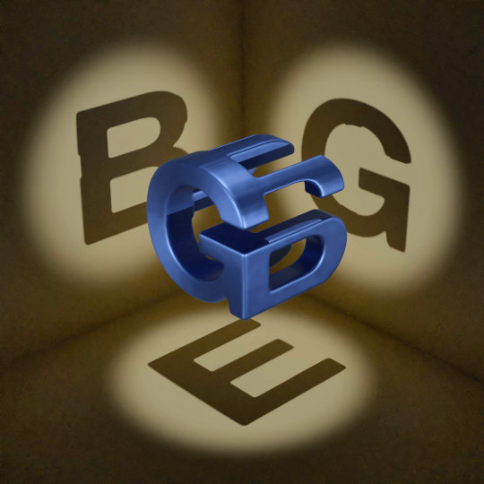
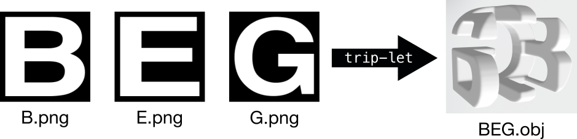

# trip-let

A simple command-line application to build Trip-lets.



A [trip-let](https://mathworld.wolfram.com/Trip-Let.html) is a three-dimensional
solid that, when projected along three perpendicular axes, produces three
letters of the alphabet (or, in general, any other shape). They were popularized
in the famous Hofstadter's book _Gödel, Escher, Bach: An Eternal Golden Braid_.

This application produces a trip-let given its three projections.

## Examples

#### BEG

```sh
trip-let -x data/B.png -y data/E.png -z data/G.png -o BEG.obj --find-best-transform
```



##### Cork Plug (aka trisquarcle)

```sh
trip-let -x data/square.png -y data/circle.png -z data/triangle.png -o trisquarcle.obj --find-best-transform
```


## Installation

```sh
# Clone the repository
git clone https://github.com/pmneila/trip-let.git

# Install requirements (PyMCubes)
cd trip-let
pip install -r requirements.txt

# Install trip-let
python setup.py install
```

Uninstall with
```sh
pip uninstall trip-let
```
